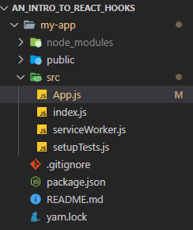
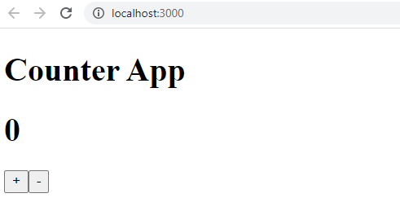
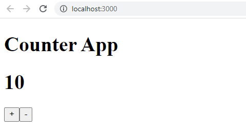
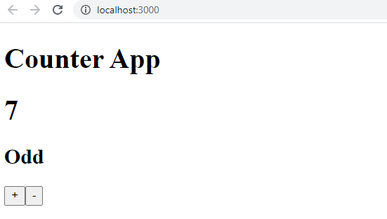

<div style="display: block;
  margin-left: auto;
  margin-right: auto; width: 35%; min-width: 245px;">

</div>
<br />
<br />
In React, there is a very important concept known as "state". You can think of state as the value stored inside of a variable. There are two types of state, local and global. Local  state refers to the values stored within variables that are declared and used within a React component. Global state on the other hand, refers to variables that are used in multiple components within the application and are usually kept within a centralized store. The really cool thing about React is that it connects the state with the UI. This means that whenever the application state gets updated, the UI will automatically rerender to reflect those changes. Previously, in order to manage state, you had to use class components. However, since the introduction of hooks, it is possible to manage state while using functional components.

<br />
<br />

As a developer, one of the operations you may want to perform is to change the local state. To achieve this, we can use the **useState** hook. Let's work through an example.

#### **useState Counter Example**
We will create an app that displays a numeric value on the screen. We will also include a plus and a minus button to increase or decrease the count.
In this tutorial we will use VSCode as the IDE.

Start by creating a new React project using the following command.

<div style="font-size: 16px; box-shadow: 0 4px 8px 0 #888888; border-radius: 5px;">

```javascript

npm init react-app my-app

```

</div>


Next, cd into the my-app folder and run the app using "npm start" to make sure everything is working correctly. Next, ensure that your src folder looks as shown below.

<div style="display: block;
  margin-left: 0; width: 23%; min-width: 244px; box-shadow: 0 4px 8px 0 #888888">
  </img>
</div>
<br />

Then, add the following code into your App.js file.

<div style="font-size: 16px; box-shadow: 0 4px 8px 0 #888888; border-radius: 5px;">

```javascript
import React, { useState } from "react"

const App = () => {
  const [counter, setCounter] = useState(0)

  return (
    <div>
      <h1>Counter App</h1>
      <h1>{counter}</h1>
    </div>
  )
}

export default App
```

</div>

As you can see, at the top we've imported the useState hook as a named import from the React library. Below it, we've defined our react functional
component using ES6 notation. Inside the functional component, we've utilized the useState hook. So what exactly is happening here?
The useState hook returns two items, "counter" and "setCounter". counter is simply a variable that has some initial value. In this case the initial value is 0. setCounter is a setter function that can be used to modify the state of counter. We will shortly see a demonstration of setCounter in action.

If you run the app, you should now see "Counter App" with a count of "0" directly below it. Next we'll need two buttons, one for incrementing and another for decrementing. Each button has an onClick event handler that will either increment or decrement the count using the setCounter setter function provided by the useState hook.

<div style="font-size: 16px; box-shadow: 0 4px 8px 0 #888888; border-radius: 5px;">

```javascript
return (
  <div>
    <h1>Counter App</h1>
    <h1>{counter}</h1>
    <button onClick={() => setCounter(counter + 1)}>+</button>
    <button onClick={() => setCounter(counter - 1)}>-</button>
  </div>
)
```

</div>

Now, when you run the application and navigate to localhost:3000 on your browser you should see the following. Clicking on the + or - buttons should now increment and decrement the counter.

<div style="display: block;
  margin-left: 0; width: 50%; min-width: 245px; box-shadow: 0 4px 8px 0 #888888">

</div>
<br />

<div style="display: block;
  margin-left: 0; width: 50%; min-width: 245px; box-shadow: 0 4px 8px 0 #888888">

</div>
<br />

In this example, we are calling setCounter directly from the onClick attribute. In cases where we need to include more complex logic, it may be a better idea to have a seperate function above the return statement which gets called by onClick. These functions are referred to as event handlers.

#### **useEffect Example**

If you've ever used class components, then you may also know about lifecycle methods. These are methods that get fired at specific instances of a components lifecycle. Some of these lifecycle methods include componentDidMount, componentDidUpdate, and componentWillUnmount. componentDidMount is a lifecycle method that executes some user-specified code whenever the component first gets mounted/rendered onto the screen. componentDidUpdate is a lifecycle method that executes some user-specified code whenever component state gets updated. Lastly, the componentWillUnmount method executes some code when the component is unmounted from the page. The execution of user-specified code at these time intervals is often referred to as "side effects".

You can think of useEffect as a combination of the three lifecycle methods above, all packaged up into a single React hook that can be used within functional components. To explain these concepts better, we'll continue from our previous counter example.

To start off, we need to utilize the useState hook once again to return two new items, "isEven" and a corresponding setter function "setIsEven". isEven is a String that indicates whether the count is an even or an odd number. It is initialized to "Even" since 0 is by definition an even number.

<div style="font-size: 16px; box-shadow: 0 4px 8px 0 #888888; border-radius: 5px;">

```javascript

  const [counter, setCounter] = useState(0);
  const [isEven, setIsEven] = useState("Even");

  //Add useEffect hook here to control the isEven variable depending on the value of counter ...

  return (

```

</div>

Next up, we'll need to do three things:

1. Import useEffect as a named import from the React library.
2. Implement the useEffect hook with logic to determine if the count is even or odd.
3. Display the isEven variable to the screen.

In the end, your code should look something like this.

<div style="font-size: 16px; box-shadow: 0 4px 8px 0 #888888; border-radius: 5px;">

```javascript
import React, { useState, useEffect } from "react"

const App = () => {
  const [counter, setCounter] = useState(0)
  const [isEven, setIsEven] = useState("Even")

  useEffect(() => {
    if (counter % 2 === 0) {
      setIsEven("Even")
    } else {
      setIsEven("Odd")
    }
  }, [counter])

  return (
    <div>
      <h1>Counter App</h1>
      <h1>{counter}</h1>
      <h2>{isEven}</h2>
      <button onClick={() => setCounter(counter + 1)}>+</button>
      <button onClick={() => setCounter(counter - 1)}>-</button>
    </div>
  )
}

export default App
```

</div>

As you can see, our "side effect" code is inside of an ES6 arrow function. That function is then passed as the first argument to the useEffect hook. The second argument is an array of dependencies. This means that the code will only get exectued when one of the specified dependencies gets updated. In this case, our only dependency is the counter. Whenever the value of counter changes, we want to execute our code and display either "Even" or "Odd".

<div style="display: block;
  margin-left: 0; width: 50%; min-width: 245px; box-shadow: 0 4px 8px 0 #888888">

</div>
<br />

That's the end of this post. Thanks for reading!